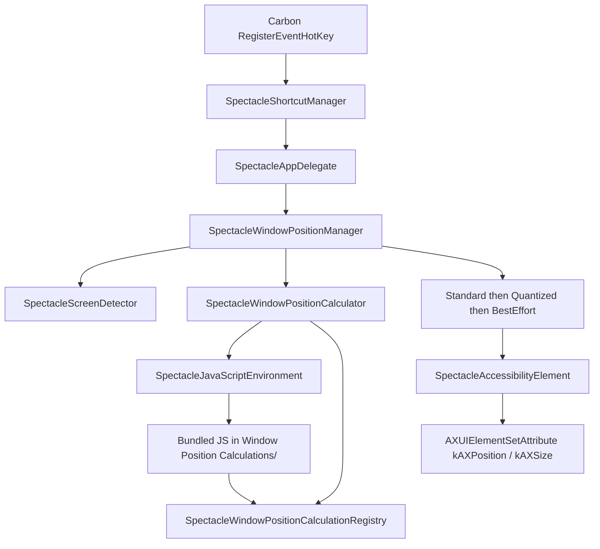

# Architecture

Map of the imported Spectacle 1.2 tree so Slice 2 does not have to rediscover the geometry engine. **No code was changed for this document.**

The app is a menu-bar `LSUIElement` (no Dock icon). Global Carbon hotkeys trigger window actions. Geometry is computed in **bundled JavaScript** via JavaScriptCore. The result is written through the Accessibility API.



## Process and UI

| Piece | Path | Role |
| --- | --- | --- |
| Entry | `Spectacle/Supporting Files/main.m` | Standard `NSApplicationMain` |
| App delegate | `Spectacle/Sources/SpectacleAppDelegate.m` | Launch: defaults, shortcuts, calculator, Sparkle, AX trust prompt |
| Menu / status item | `Spectacle/Resources/Localizations/Base.lproj/Spectacle.xib` | Menu-bar extra |
| Preferences | `SpectaclePreferencesController.m` + `SpectaclePreferencesWindow.xib` | Shortcut recorder UI, login item, updates checkbox |
| Bundle ID (still original) | `Spectacle.xcodeproj/project.pbxproj` | `com.divisiblebyzero.Spectacle` |
| Version | `Spectacle/Supporting Files/Info.plist` | `CFBundleShortVersionString` 1.2, min OS 10.9 |

`applicationDidFinishLaunching:` in `SpectacleAppDelegate.m` wires storage → shortcut manager → window position manager, then calls `SUUpdater` and `AXIsProcessTrustedWithOptions`.

## Window pipeline (the behavior spec)

### 1. Action names

`SpectacleWindowAction` is a typedef for `NSString *`. Constants live in `Spectacle/Sources/SpectacleWindowAction.m` and **must match** the strings JS uses when registering calculators:

`Undo`, `Redo`, `Larger`, `Smaller`, `None`, `Center`, `Fullscreen`, `LeftHalf`, `UpperLeft`, `LowerLeft`, `RightHalf`, `UpperRight`, `LowerRight`, `TopHalf`, `BottomHalf`, `NextDisplay`, `PreviousDisplay`, `NextThird`, `PreviousThird` (each prefixed `SpectacleWindowAction`).

Undo/redo skip the JS calculator and replay `SpectacleHistory` (`SpectacleWindowPositionManager.m`).

### 2. JavaScript geometry

`SpectacleJavaScriptEnvironment` (`Spectacle/Sources/SpectacleJavaScriptEnvironment.m`):

- Creates a `JSContext`.
- Loads **every** `*.js` from the app bundle directory `Window Position Calculations` (`pathsForResourcesOfType:inDirectory:`).
- Evaluates those files with `evaluateScript:`. There is no user-supplied JS and no network fetch of scripts.

`SpectacleWindowPositionCalculator` injects into that context:

- `windowPositionCalculationRegistry` (the ObjC registry, via `JSExport`)
- `CGRectContainsRect`, `CGRectEqualToRect`, `CGRectGetMinX/MinY/MidX/MidY/MaxX/MaxY`

Each action JS file calls `windowPositionCalculationRegistry.registerWindowPositionCalculationWithAction(fn, "SpectacleWindowAction…")`. The protocol is `SpectacleWindowPositionCalculationRegistryExports` in `SpectacleWindowPositionCalculationRegistry.h`.

Calculator function signature (see e.g. `SpectacleLeftHalfWindowCalculation.js`):

```text
function (windowRect, visibleFrameOfSourceScreen, visibleFrameOfDestinationScreen) -> CGRect
```

Shared helpers: `SpectacleWindowCalculationHelpers.js`, `SpectacleWindowSizeAdjuster.js`, `SpectacleNextOrPreviousThirds.js`, `SpectacleNextOrPreviousDisplay.js`.

Halves and corners **cycle** 1/2 → 2/3 → 1/3 when the shortcut is repeated (implemented in the per-action JS, not in ObjC).

Do not “fix” these JS files because a test looks old. They are the spec (ADR-005).

### 3. Screen choice

`SpectacleScreenDetector` uses `NSScreen` `frame` / `visibleFrame`. Next/previous display walks screens in a stable order. Coordinates flip between Accessibility (top-left) and AppKit (bottom-left) via `+[SpectacleAccessibilityElement normalizeCoordinatesOfRect:frameOfScreen:]`.

### 4. Apply the frame

Default mover chain, constructed in `SpectacleWindowPositionManager`’s convenience initializer:

1. **Standard** — write the calculated rect (`setRectOfElement:`).
2. **Quantized** — if the OS did not honor size (grid-snapping apps), shrink by 2pt steps and re-center.
3. **BestEffort** — clamp into `visibleFrame` so the window stays on-screen.

Each write is `AXUIElementSetAttribute` for `kAXSizeAttribute` then `kAXPositionAttribute` then size again (`SpectacleAccessibilityElement.m` `setRectOfElement:`).

History is per frontmost application bundle ID (`SpectacleHistory` / `SpectacleHistoryItem`).

## Shortcuts

- **Registration:** Carbon `RegisterEventHotKey` in `SpectacleShortcutManager.m` (signature `'ZERO'`). Not MASShortcut.
- **Recorder:** custom `SpectacleShortcutRecorder` (Carbon), not a third-party control.
- **Storage:** `SpectacleMigratingShortcutStorage` reads UserDefaults (`SpectacleShortcutUserDefaultsStorage`) until `~/Library/Application Support/Spectacle/Shortcuts.json` exists, then JSON (`SpectacleShortcutJSONStorage`).
- **Defaults:** `SpectacleDefaultShortcutHelpers.m`.
- **Parsing / display:** `SpectacleShortcutKeyBindings.m`, `SpectacleShortcutTranslations.m`.

## Tests (`SpectacleSpecs`)

Specta + Expecta + OCHamcrest + OCMockito (Carthage). One calculation spec per action JS file that has a dedicated calculator, plus shortcut specs:

| Spec | Covers |
| --- | --- |
| `Spectacle*WindowCalculationSpec.m` (halves, corners, thirds, displays, larger/smaller, center, fullscreen) | JS calculator outputs |
| `SpectacleWindowPositionManagerSpec.m` | manager / history / movers with mocks |
| `SpectacleShortcutSpec.m` | shortcut model |
| `SpectacleShortcutKeyBindingsSpec.m` | key-binding parse |
| `SpectacleShortcutTranslationsSpec.m` | display strings |

Travis (dead): `.travis.yml` uses `osx_image: xcode8.2`, `carthage bootstrap --platform Mac`, `xcodebuild … test`.

## What Slice 2 should not rediscover

- Geometry lives in JS, not in `SpectacleWindowPositionCalculator.m` (that file only hosts JSContext and calls the registered function).
- Mover chain order is Standard → Quantized → BestEffort.
- Action string literals are the JS ↔ ObjC contract.
- Frameworks are expected at `Carthage/Build/Mac` (`FRAMEWORK_SEARCH_PATHS` in the pbxproj). `Carthage/Build` is gitignored; a clean clone has no Sparkle binary until Carthage/SPM runs.
- `CODE_SIGN_IDENTITY = "-"` (ad-hoc) already.
